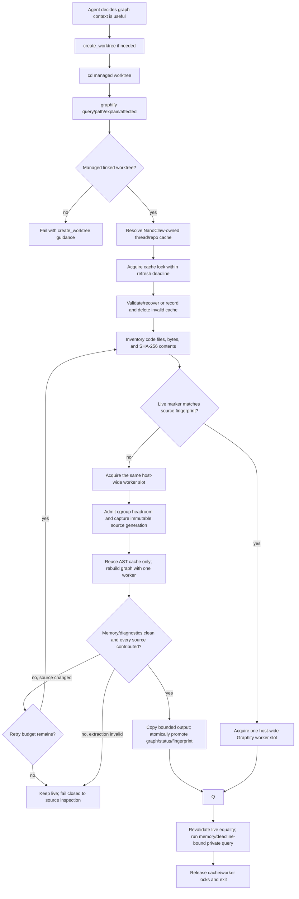

# Design: Automatic Graphify Code Intelligence for Container Agents

> Generated by `/team-design` — 2026-07-18
> Saved to: `docs/specs/graphify-container-code-intelligence/design.md`

## Brief Reference

This design implements the approved [Graphify container code-intelligence brief](brief.md): retire GitNexus from container agents, make a pinned Graphify CLI universal but lazy, and guarantee that every graph query first reconciles a disposable index with the current managed worktree without manual refreshes, persistent processes, or generated files in the repository.

Host/operator GitNexus remains outside this design. Live activation remains a rollout decision after build and runtime validation.

---

## Constraint Analysis

| #   | Constraint                                                                                                                                | Type | Source                                                                         | Status                                                                                                                                                                                                  |
| --- | ----------------------------------------------------------------------------------------------------------------------------------------- | ---- | ------------------------------------------------------------------------------ | ------------------------------------------------------------------------------------------------------------------------------------------------------------------------------------------------------- |
| C1  | Index freshness is automatic; no user or operator refresh step exists.                                                                    | HARD | Approved brief                                                                 | Validated — each invocation captures a new immutable source generation when live content differs, and Graphify must exactly match that generation before query.                                         |
| C2  | GitNexus is absent from the container-agent runtime, not merely hidden from prompts.                                                      | HARD | Approved brief                                                                 | Validated — image, mounts, runtime injection, hooks, skills, config, and commit advisory are all in the retirement boundary.                                                                            |
| C3  | Graphify is one-shot CLI only, with no MCP server, watcher, or daemon.                                                                    | HARD | Approved brief                                                                 | Validated — every lock wait and child process shares an explicit deadline and descendant-termination contract.                                                                                          |
| C4  | Generated indexes remain outside repositories and Git history.                                                                            | HARD | Approved brief                                                                 | Validated — cache is stored in NanoClaw-owned hidden state beside, never inside, checked-out repositories.                                                                                              |
| C5  | Existing managed-worktree safety and provider parity remain authoritative.                                                                | HARD | Approved brief; `AGENTS.md` Container Runtime and Key Files                    | Validated — Graphify cannot create, fetch, switch, or rebase worktrees and is exposed below the provider layer.                                                                                         |
| C6  | A failed/interrupted refresh cannot replace a complete index or permit a stale query.                                                     | HARD | Approved brief                                                                 | Validated — isolated source generation, full graph assembly from applicable per-file contributions, kernel-bounded worker validation, process-atomic promotion, then query.                             |
| C7  | Indexing is lazy and valid caches survive container restarts.                                                                             | SOFT | Approved brief                                                                 | Validated — no startup work; cache lives in separately mounted host-backed thread/session application state.                                                                                            |
| C8  | The freshness gateway must be the only supported `graphify` command exposed on `PATH`; user-supplied output/graph paths cannot bypass it. | HARD | Implicit from C1 and agentic-systems boundary design                           | Added — required for mechanical rather than prompt-only freshness.                                                                                                                                      |
| C9  | A thread/repository cache and lock must be shared by sibling agents using the same managed worktree, but isolated from other worktrees.   | HARD | Implicit from sibling worktree mounting at `src/container-runner.ts:1315-1342` | Added — required for safe provider parity and concurrent siblings.                                                                                                                                      |
| C10 | Graphify's agent skill must remain present even when a group selects a restricted skill list.                                             | HARD | Implicit from universal availability and `src/container-runner.ts:2383-2399`   | Added — an installed binary without discoverable workflow does not satisfy the agentic requirement.                                                                                                     |
| C11 | The complete resolved Python dependency closure must respect the repository's three-day dependency-age policy without an exclusion.       | HARD | `AGENTS.md` Supply Chain Security; approved brief                              | Validated by design — exact wheels and hashes only; ARM64/Python-targeted resolution and `--only-binary` installation forbid undeclared build dependencies.                                             |
| C12 | Graphify extraction must have explicit per-process and fleet-wide resource admission bounds.                                              | HARD | Review cycle 1; incident context                                               | Validated by design — one sequential worker, one host-wide slot, input/output caps, cgroup headroom admission, kernel-enforced worker limits, and supervisor deadlines.                                 |
| C13 | Graphify must demonstrate source-grounded retrieval usefulness, not only lower memory use.                                                | HARD | Review cycle 1; user value question; user-approved v4 policy                   | Validated by design — deterministic command fixtures plus one final frozen v4 comparison whose claim correctness, execution grounding, treatment adherence, and efficiency gates are scored separately. |

### Flagged Constraints

- **Live activation is a rollout gate, not an architecture constraint.** The image can be built and verified without restarting active containers. The service/container restart decision stays at the ship gate after checking in-flight turns.
- **“Only supported CLI” is not a hostile-code sandbox.** The NanoClaw gateway owns `/usr/local/bin/graphify`, rejects bypass flags, and does not advertise the package's internal module entrypoint. A same-user shell process could still deliberately invoke Python modules from the image. The design guarantees correct normal agent operation, not containment against a malicious process already allowed arbitrary shell execution.
- **Freshness is generation-based, not a filesystem-wide transaction.** Graphify reads only a private immutable source generation captured by the current invocation; it never reads a prior generation after detecting changed live content. Repeated live comparisons reject ordinary overlapping edits before query, but arbitrary shell writers do not honor a common lock and ext4 provides no atomic multi-file snapshot primitive. The hard guarantee is that graph, status, and fingerprint exactly match the newly captured immutable generation and that a failed/mismatched refresh never queries an older cache. It does not claim a globally linearizable instant across adversarial non-cooperating writers—ordinary compilers and source scanners have the same boundary.
- No brief constraint was downgraded. No contradictions were found.

---

## Research Summary

### Project patterns

- The image already pins fleet-wide CLIs using Docker build arguments (`container/Dockerfile:95-100`, `381-415`) and already includes Python plus an isolated uv environment, so Graphify fits the existing pinned-image-tool pattern.
- The managed `create_worktree` flow fetches and safely refreshes the default branch while refusing dirty rebases and branch mismatches (`container/agent-runner/src/mcp-tools/git-worktrees.ts:462-588`). Graphify must consume that worktree, not duplicate its lifecycle.
- Sibling agents in one thread share the same host-backed `/workspace/worktrees` mount (`src/container-runner.ts:1315-1342`). The host can mount a sibling thread-state directory at `/workspace/.cache/graphify`, giving the same sibling sharing without occupying the direct-child repository namespace or leaking across threads.
- Current cleanup enumerates every direct child of `worktrees/` as a repository and already skips targets while any mapped participant container is live (`src/worktree-cleanup.ts:128-160,238-245`). Graphify cache removal must extend that lifecycle guard and never independently delete a cache for a live container.
- Skills are materialized from `container/skills` through the host's selection function (`src/container-runner.ts:2195-2236`, `2383-2399`). A mandatory-skill union is the provider-neutral place to make this workflow discoverable.
- `agentic-systems` favors capability boundaries that make the safe behavior intrinsic rather than relying on an agent remembering a procedure. `llm-engineering` favors provider-neutral instructions at a shared runtime boundary over separate Claude/Codex prompt forks.

### Existing GitNexus surface to retire

- `container/Dockerfile:24-87,364-419` builds and copies GitNexus plus its native runtime.
- `container/agent-runner/src/gitnexus-runtime.ts:76-148` discovers a mounted plugin, injects an MCP server and instructions, and creates a Claude overlay.
- `container/agent-runner/src/index.ts:169-181` activates that runtime; `container/agent-runner/src/providers/claude.ts:1083-1141` applies the overlay.
- `src/container-runner.ts:1590-1602` always mounts GitNexus-specific built-in hooks, while `src/container-runner.ts:1613-1639` can independently remount a host `~/plugins/gitnexus` directory.
- `container/entrypoint.sh:119-152` registers GitNexus indexes at container startup.
- `container/agent-runner/src/mcp-tools/git-worktrees.ts:594-700` runs a GitNexus post-commit advisory.
- The active `gitnexusInjectAgentsMd` config path reaches container environment construction at `src/container-runner.ts:2789-2792` and must be removed from active config/capability/parity surfaces.

### Graphify upstream facts

- The official package is `graphifyy`, requires Python 3.10+, and installs the `graphify` CLI. Code extraction is local tree-sitter work and needs no model/API key in code-only mode. The official command set includes `query`, `path`, `explain`, and `affected`. See the [official Graphify repository](https://github.com/Graphify-Labs/graphify) and [PyPI package](https://pypi.org/project/graphifyy/).
- In tag [`v0.9.16`](https://github.com/Graphify-Labs/graphify/tree/v0.9.16), `GRAPHIFY_OUT` accepts an absolute output directory and is honored by readers and writers; `extract --out` is also tested to leave the scanned repository untouched.
- The same tag switches `extract` to incremental mode when both `manifest.json` and `graph.json` exist, detects changed/new/deleted files from the working tree, preserves a no-op graph, and tests removal of stale import edges. This is filesystem reconciliation, not a `HEAD`-only check.
- The tag can report top-level, per-file, zero-node, missing-parser, and cross-file-resolution failures as diagnostics while continuing, and its manifest can stamp files that contributed no nodes. Exit zero, JSON shape, and manifest hashes are therefore not a sufficient success contract. The gateway must audit every pinned soft-failure path and require a machine-readable per-file graph-contribution set equal to the supported source inventory.
- The JSON extractor intentionally classifies fixtures/datasets as `skipped: data json` with zero nodes even though detection calls every `.json` file code. Those exact pinned intentional skips belong in a machine-readable non-applicable set; any other missing contribution remains a hard failure.
- Graphify's AST cache is content-addressed, version-namespaced, and stores relative `source_file` values. The first ship may safely reuse only those cache entries across private snapshots while rebuilding `graph.json` from the complete snapshot on every changed fingerprint; it must not reuse an old graph or manifest during a changed build.
- The CLI does not expose its internal `parallel=False` control, and manifest saving unconditionally uses `ThreadPoolExecutor`. NanoClaw therefore carries one exact-version patch that honors `NANOCLAW_GRAPHIFY_SEQUENTIAL=1` for both AST extraction and manifest hashing. Image contract tests verify the patch applies only to v0.9.16, the real workflow succeeds under `RLIMIT_NPROC=0`, and source drift fails the build rather than silently accepting an unpatched package.
- v0.9.16 also conflates the external AST cache location with the source-root anchor when `--out` is used; the later upstream root-anchor fix is backported in the same exact-version patch so source attribution and portable AST reuse remain repository-relative. Capital-F Fortran extraction shells out to `cpp`; the gateway rejects those five preprocessed extensions for the first ship, and the limited worker sets `RLIMIT_NPROC=0` so no other subprocess path can escape the single-process memory boundary.
- `graphifyy==0.9.16` has ranged transitive dependencies. The image must install from a committed ARM64/Python-targeted wheel-only, hash-locked resolution produced with a release-age cutoff. Source distributions are forbidden so undeclared PEP 517 build dependencies cannot enter the production closure.
- The package's own skill has a fast path that queries an existing graph without forcing refresh and its normal workflow writes `graphify-out` in the project. It will not be installed verbatim because both behaviors conflict with C1/C4.
- PyPI lists `0.9.16` as uploaded at `2026-07-14T23:03:35Z`; at the design check (`2026-07-18T14:19:21Z`) it was over 72 hours old. Releases `0.9.17` through `0.9.19` were newer than the policy window. The first ship therefore pins `graphifyy==0.9.16` without a release-age exclusion.

---

## Options

### Option A: Enforcing CLI Gateway with Per-Worktree Transactional Cache

**Approach:** Install a wheel-only, fully locked Graphify environment in the image, remove its public console script, and expose a NanoClaw-owned `/usr/local/bin/graphify` gateway. Every allowed graph-read command inventories the current managed worktree, reuses a matching live index or copies an immutable code snapshot, performs a deadline/memory-bound globally admitted refresh that rebuilds the full graph while reusing only valid content-addressed AST cache entries, proves per-file contribution, then queries the accepted graph while holding the cache lock.

**Pros:**

- Freshness is mechanical for every supported query, including dirty, new, and deleted files.
- One CLI and one mandatory skill work identically for Claude, Codex, OpenCode, and future providers.
- No long-lived process consumes idle memory.
- The repository remains clean, sibling access is serialized, and prior complete state survives failed refreshes.
- Index creation remains lazy because the gateway is not invoked at container startup.

**Cons:**

- NanoClaw owns a small Python gateway and its transaction/recovery tests.
- Every query hashes the relevant code inventory; changed queries also pay snapshot-copy and complete graph-assembly cost, although unchanged per-file AST parsing is served from content-addressed cache.
- NanoClaw owns resource admission, process-group cleanup, cache cleanup, and the source/index validation contract in addition to the gateway.
- Graphify's internal module remains technically executable by an arbitrary same-user shell process even though it is not a supported public command.

**Pattern alignment:** Matches the Dockerfile's pinned fleet-wide CLI convention, the shared-worktree architecture, and the `agentic-systems` preference for enforced capability boundaries. It does not add a provider-specific MCP or prompt path.

**Confidence:** Medium — upstream features and project integration are grounded, but the locked ARM64 install, source-inventory parity, resource ceilings, retrieval usefulness, and production-style sibling lifecycle still need executable validation.

**Assumptions:**

- Graphify `0.9.16` produces a source-attributed node for every supported representative source file and correctly answers the committed repository tasks.
- Content hashing the Graphify-detected code inventory is fast enough for every graph query.
- A one-worker, one-host-extraction-slot default plus the child memory ceiling fits the deployed container admission budget and remains useful interactively.

### Option B: Skill-Only Upstream CLI Workflow

**Approach:** Install the upstream CLI and skill directly, tell agents to run `graphify extract --code-only` before querying, and point `GRAPHIFY_OUT` outside the repository. Rely on the model to follow the refresh instruction.

**Pros:**

- Minimal NanoClaw code.
- Closest to upstream documentation and easiest to upgrade.

**Cons:**

- The upstream fast path can query an existing graph without refreshing it.
- Correctness depends on model compliance and differs across provider instruction systems.
- Direct CLI flags can point queries at stale or repository-local graph data.
- It fails C1, C4, C8, and C10 even if the written instructions are strong.

**Pattern alignment:** Misaligned with the approved fully-agentic requirement and with `agentic-systems`; it treats an invariant as prompt advice.

**Confidence:** High that it is simpler; High that it does not meet the hard constraints.

**Assumptions:**

- Agents never skip, reorder, or incorrectly target the manual refresh command. This assumption is unacceptable for C1.

### Option C: Hook/Watcher-Maintained Index

**Approach:** Refresh after commits/checkouts using hooks, or keep a file watcher running while a worktree is active. Queries read the last generated graph directly.

**Pros:**

- Queries can be fast when background refresh has already completed.
- Hooks can reuse familiar Git lifecycle events.

**Cons:**

- Commit hooks miss modified/untracked/deleted working-tree changes before commit.
- A watcher adds a persistent process and idle memory to every active code session.
- Hooks are bypassed by existing `git_commit --no-verify` behavior and provider shell variation.
- Crash ordering creates a separate freshness/read race unless a query gate is added anyway.
- It fails C1, C3, and the dirty-worktree portion of the brief.

**Pattern alignment:** Misaligned with NanoClaw's bounded-container resource goals and the explicit one-shot CLI constraint.

**Confidence:** High that hooks/watchers can provide opportunistic prewarming; High that neither can be the correctness mechanism here.

**Assumptions:**

- All relevant source changes are accompanied by a hook event or observed by a continuously healthy watcher. That is false for the required workflow.

---

## Recommendation

**Selected:** Option A — Enforcing CLI Gateway with Per-Worktree Transactional Cache.

It is the only option that satisfies all hard constraints simultaneously. The key distinction is that the skill decides _when Graphify is useful_, while the CLI gateway decides _whether a query is allowed_. Model judgment can stay flexible; freshness cannot.

**Confidence note:** Confidence is Medium until the build stage proves the `0.9.16` ARM64 installation, per-worktree cache lifecycle, concurrency, and unchanged-query timing in the production image. Those are build/QA gates, not unresolved product choices. Failure of any one rolls the design back rather than weakening freshness.

---

## Selected Architecture

### Runtime flow

### 1. Image installation and public command boundary

- `container/Dockerfile` replaces the GitNexus builder/copy/doctor layers with an exact Graphify environment under `/opt/graphify`. No `[mcp]`, watcher, document/media, or model extras are installed.
- [`container/graphify-requirements.lock` — **NEW**, owned by container runtime] is generated from `graphifyy==0.9.16` for the production Linux ARM64/Python target with an explicitly recorded uv version, `--exclude-newer` cutoff, exact transitive versions, and wheel hashes. The cutoff is the build-design time minus 72 hours. Docker uses the image's Python/pip to install only this lock with `--require-hashes --only-binary=:all: --no-deps`; it never invokes uv, resolves dependency ranges, or permits an sdist/build dependency during the image build. Lock regeneration is deliberate, and every selected wheel upload time is audited before acceptance.
- The upstream console script is not exposed on `PATH`. The public command `/usr/local/bin/graphify` is NanoClaw's supervisor [`container/graphify-gateway.py` — **NEW**, owned by container runtime] with a private-environment shebang. It owns command policy, locks, deadlines, recovery, and promotion. Extraction, graph validation, and query execute in a private [`container/graphify-worker.py` — **NEW**] subprocess that imports the pinned package and applies kernel resource limits before loading Graphify.
- [`container/graphify-v0.9.16-nanoclaw.patch` — **NEW**] makes the exact pinned CLI pass `parallel=False` and makes manifest hashing sequential only when `NANOCLAW_GRAPHIFY_SEQUENTIAL=1`, then backports the source-root/cache-location separation used by the later upstream fix. The image build applies it with exact context and fails on drift. This ensures the limited worker needs no Python task creation and that external-cache source attribution remains repository-relative.
- Every agent container receives an empty-on-start 192 MiB tmpfs at `/workspace/.graphify-stage`. It consumes no idle memory and is the only location where a private worker may generate new Graphify output. Docker's tmpfs size is the hard aggregate output quota; the persistent cache receives a candidate only after successful limited-worker validation.
- The gateway allows `query`, `path`, `explain`, and `affected`, plus side-effect-free help/version. It rejects extraction, install, hook, watch, MCP, global-graph, user `--graph`, and user output-path overrides. It overwrites `GRAPHIFY_OUT` and disables upstream query logging so no state escapes the owned cache.
- Image tests assert the exact installed version set and lock hashes, wheel-only ARM64 installation, exact patch, repository-relative source attribution, portable AST reuse across two private generations, real extraction/manifest/query success under `RLIMIT_NPROC=0`, tmpfs `ENOSPC`, no Graphify descendants, absence of `/pnpm/gitnexus`, absence of a `gitnexus` executable, and that `graphify` resolves to the NanoClaw supervisor.

### 2. Worktree and cache identity

- The gateway resolves the source root with `git rev-parse --show-toplevel` and rejects roots outside realpath `/workspace/worktrees`. It never creates or mutates Git branches; the error instructs the agent to call the existing `create_worktree` tool.
- Cache root: `/workspace/.cache/graphify/<validated-repo-name>/`. `src/container-runner.ts` bind-mounts this from an application-state sibling of the owning worktree directory: thread state for shared thread worktrees, session state otherwise. It is shared by siblings but is outside `/workspace/worktrees`, every checkout, Git-private metadata, and the legal repository-name namespace.
- Owned entries:
  - `lock` — stable `fcntl.flock` target.
  - `live/` — last complete Graphify output directory plus accepted status metadata.
  - `stage-<pid>-<nonce>/source/` — transient, private source generation; removed before promotion.
  - `stage-<pid>-<nonce>/out/` — supervisor copy of an already-validated, tmpfs-bounded graph/manifest plus content-addressed AST cache entries; private workers never write here directly.
  - `backup/` — prior live directory during promotion/recovery only.
  - `live/source-state.json` — Graphify version, sorted source paths/hashes/bytes, accepted SHA-256 fingerprint, and acceptance timestamp; staged and promoted with the graph.
  - `live/extraction-status.json` — detected, applicable, intentionally excluded, contributed, unsupported, and failed file sets plus classified diagnostics; promotion requires `contributed == applicable` and `detected - contributed == intentional_exclusions` with no unsupported/failed files.
  - `diagnostics/` — at most two capped 64 KiB textual/JSON failure records; failed source/output candidates are deleted, not quarantined.

`src/worktree-cleanup.ts` carries the resolved application cache path with each worktree target, removes the matching `<repo>` cache only after safe worktree removal, and prunes orphaned cache entries only after the same all-participant `isContainerRunning` guard proves no owning container is live. Per-repository `lock` is never part of a promoted generation and is never unlinked while a container may hold it. Wholesale thread/session deletion removes the sibling application-state root. `create_worktree` invalidates a matching cache when it replaces a corrupt worktree. Cleanup tests cover a live participant, dirty/unpushed worktrees, and an active gateway-shaped lock holder to prove cache cleanup never weakens source-work preservation or creates a second lock inode.

### 3. Freshness transaction

The gateway owns [`refresh_index(repo_root, cache_root)` — **NEW**, created in `container/graphify-gateway.py`]:

1. Start one monotonic refresh budget. The first ship defaults `NANOCLAW_GRAPHIFY_REFRESH_TIMEOUT_SECONDS` to 900; cache-lock wait, host-admission wait, snapshot retries, and extraction all consume that single budget. Acquire the stable per-cache lock by nonblocking polling until the budget expires. Kernel lock release on process/container exit prevents stale ownership.
2. Validate `live/`, `backup/`, `source-state.json`, and `extraction-status.json`. Restore a valid backup only when live is absent/invalid. If both are invalid, record capped metadata/hashes, delete the invalid artifacts, and immediately proceed with an empty full-build stage; no operator cleanup is required. Remove abandoned stages while locked.
3. Inventory the live worktree with pinned `graphify.detect.detect` semantics. Any `walk_errors`, unreadable file, path escaping the repository through a symlink, detected code language with no in-process extractor, capital-F preprocessed Fortran extension (`.F`, `.F90`, `.F95`, `.F03`, `.F08`), file over 5 MiB, more than 4,000 code files, or more than 64 MiB of aggregate code input fails closed before Graphify starts. For every sorted repo-relative code path, compute SHA-256 over contents for the source-generation fingerprint and MD5 solely to compare with Graphify 0.9.16's manifest hash. Detected data JSON remains in this freshness inventory even when the pinned extractor later classifies it as intentionally non-applicable.
4. If validated live state has the same Graphify version and exact source fingerprint, skip extraction. This mandatory check coalesces queued callers after one owner refreshes.
5. Otherwise acquire the host-wide Graphify worker slot at `/run/nanoclaw-graphify/worker.lock`, mounted from an application-owned host runtime directory into every container, and retain it through the eventual query. Re-inventory after waiting. The first ship admits exactly one Graphify worker of any kind across the host and passes `--max-workers 1`; increasing either bound requires the same cgroup/performance QA gate. The mutex is deliberately an exclusion gate, not a second scheduler: the host's existing interactive-first memory admission remains the scheduling boundary, and wait events make contention measurable.
6. Admit memory before copying or spawning: read cgroup v2 `memory.current`/`memory.max`; require current usage plus the 1,024 MiB worker address-space ceiling, 384 MiB worst-case simultaneous tmpfs/host-stage output, and a 512 MiB protected-runner reserve to fit below the hard container limit. `requestMb` remains host admission accounting for normal residency, while `limitMb` is deliberately the burst/OOM boundary; forcing the transient ceiling into the 2,048 MiB request would make Graphify unusable at the measured ~1.2 GiB agent baseline. The host-wide all-worker slot bounds this permitted burst across the fleet. Refusal is a normal fail-closed source-inspection fallback.
7. Create a fresh same-filesystem stage. Copy only detected code files into `stage/source/`, preserving repository-relative paths without following escaping symlinks. Hash the completed private generation and require a fresh live inventory to match it exactly. The generation is then read-only to the private worker and is the only source root Graphify may read. This guarantees graph/generation equality even though the multi-file capture is not a filesystem-wide atomic snapshot against non-cooperating writers.
8. Empty `/workspace/.graphify-stage`, create a nonce directory there, and independently compute the exact pinned Graphify `file_hash` (content plus lowercased repository-relative path) for every current source-generation file. A live AST entry is seed-eligible only when current and prior `source-state.json` contain the same exact case-sensitive relative path and content hash and neither generation has another path with the same case-folded spelling. Case-only renames and current/prior case-fold collisions force fresh extraction by seeding no ambiguous entry. Copy only eligible `<expected-hash>.json` files into `out/cache/ast/v0.9.16/`; never copy obsolete same-version hashes, other versions, stat indexes, temp files, the old graph/manifest/state/status, or more than 128 MiB. Spawn the private worker in a new process group. Before importing Graphify it sets native library thread counts to one and applies hard `RLIMIT_AS=1,024 MiB`, `RLIMIT_FSIZE=64 MiB`, and `RLIMIT_NPROC=0`, then invokes the patched CLI in-process with `NANOCLAW_GRAPHIFY_SEQUENTIAL=1`, `GRAPHIFY_OUT=<tmpfs-nonce>/out`, query logging disabled, and `extract <stage/source> --code-only --max-workers 1`. This reuses only unambiguous unchanged current-generation parses but assembles the entire graph from the immutable generation; the exact patch removes mandatory AST/manifest task creation, the inventory rejects the known `cpp` extractor, and the kernel process limit blocks any unclassified task.
9. The supervisor owns the refresh deadline and process group. On expiry it sends SIGTERM, waits the default five-second grace, then SIGKILL. Kernel limits bound rapid allocation, file growth, and process creation before userspace can react; cgroup/RSS sampling remains telemetry only. Because extraction and validation run inside the same limited child-free worker, the in-flight agent runner remains outside the Graphify limit and the prior live generation is untouched.
10. Inside the limited worker, run the pinned JSON extractor against each source-generation `.json`; an exact `skipped: data json` result is an intentional exclusion, not a failure. Reject nonzero exit, tmpfs `ENOSPC`, every other audited v0.9.16 soft-incomplete diagnostic (walk, skipped file, worker, unexpected zero-node, no extractor, missing dependency, AST pass, manifest write, and cross-file resolution failures), invalid JSON, graph over 64 MiB, AST cache over 128 MiB, unexpected schema, or manifest/hash mismatch. The 192 MiB tmpfs is the hard aggregate generation quota. The pinned graph contract requires `nodes` and `links` arrays. Normalize node `source_file` values against the private generation and write `extraction-status.json`; `contributed` must equal `applicable`, and the detected non-contribution set must equal only the preclassified intentional JSON exclusions, with no unsupported/failed files. A contract-drift test inventories pinned upstream failure, intentional-skip, subprocess, and thread-pool sites and fails when the classifier/patch is incomplete.
11. Re-inventory live source after extraction. If it differs from the immutable generation, delete tmpfs/stage output and retry from step 3 up to two times within the same budget. When equal, finalize the worker status, remove `stage/source/` only after its hashes are recorded, and return the bounded candidate to the supervisor.
12. After successful worker validation, copy the already-bounded tmpfs `out/` and status into the host-backed same-filesystem `stage/out/`, write `source-state.json`, validate sizes/hashes without loading graph content in the supervisor, then delete the tmpfs nonce. Promote by renaming `live/` to `backup/` and the complete host stage to `live/`; validate metadata, then remove backup. If copy/promotion fails, restore a valid backup. Failed tmpfs output is deleted immediately; diagnostics retain only capped metadata. This guarantees process-atomic visibility to cooperating gateway readers but does not claim power-loss durability.
13. If the changed-refresh path does not already hold it, first acquire the same host-wide worker slot within the 120-second query budget; cached queries therefore cannot overlap another Graphify worker. Only after holding that slot, perform two consecutive live inventories immediately before the private read, require them to equal each other and the accepted generation state, and release/restart from step 3 on mismatch. These scans detect ordinary overlapping edits but are not described as a global linearization point. Run the requested private read in a new limited worker process group with `GRAPHIFY_OUT=<live/out>` while retaining the cache lock. The same 1,024 MiB `RLIMIT_AS`, 64 MiB `RLIMIT_FSIZE`/graph cap, `RLIMIT_NPROC=0`, 512 MiB protected reserve below `memory.max`, and TERM/grace/KILL contract apply. Release both locks on every exit path.

If any required refresh/validation/admission step fails, the previous `live/` remains intact but is deliberately _not queried in that invocation_. The gateway exits nonzero with a concise fallback instruction: inspect authoritative source directly and retry Graphify later. Structured stderr events report cache wait, global wait, refresh mode, input size, worker RSS/virtual size, tmpfs high-water, retry, duration, and terminal reason without logging the user's query text or source content.

### 4. Lazy agent workflow and provider parity

- Add [`container/skills/graphify/SKILL.md` — **NEW**, owned by the shared container skill layer]. It is NanoClaw-specific, not copied from upstream.
- The skill tells agents to use Graphify for architecture, call/dependency paths, impact/affected analysis, and codebase exploration; source, tests, and build output remain authoritative.
- It requires `create_worktree` before code intelligence and running `graphify ...` from the managed worktree. It never mentions `extract`, `update`, hooks, MCP, or manual refresh because those are not user/agent responsibilities.
- `selectedSkillNames` unions a small `MANDATORY_CONTAINER_SKILLS = ['graphify']` set with both `skills: 'all'` and explicit group skill lists. Existing shared-skill projection/mirroring then provides the same skill to Claude, Codex, OpenCode, and future provider paths.
- Every container receives `NANOCLAW_CONTAINER=1`. The repository’s generated `CLAUDE.md`/`AGENTS.md` code-intelligence section is revised at its tracked source to state: in NanoClaw containers, the Graphify skill/gateway is authoritative and host GitNexus commands do not apply; in host/operator development sessions, the existing GitNexus rules remain. Provider tests inspect the effective instructions rather than relying on precedence assumptions.
- Merely mounting the skill does no work. Knowledge-only conversations create neither worktrees nor indexes; the first public Graphify query creates the cache.

### 5. Complete container-side GitNexus retirement

Implementation removes all active container-agent paths, while retaining host contributor tooling:

- Delete the GitNexus Docker builder, binary/database copies, checks, version argument, and native build allowlists.
- Delete `container/agent-runner/src/gitnexus-runtime.ts` and its tests; remove runner activation and Claude overlay calls.
- Delete `container/nanoclaw-plugin` because its shipped contents are GitNexus readiness/post-commit hooks; remove its built-in mount.
- Add `gitnexus` to the host-plugin shadow/exclusion set so an operator's `~/plugins/gitnexus` remains installed on the host but cannot re-enter agent containers.
- Delete entrypoint repo registration and GitNexus commit advisory code/tests; `git_commit` returns only its commit result.
- Remove `gitnexusInjectAgentsMd` from active container config, capability, environment, and sibling-parity surfaces. Legacy serialized unknown fields are ignored rather than migrated into a replacement behavior.
- Remove or revise current runtime docs/comments/tests that claim container GitNexus availability. Historical records remain untouched. The repository’s host-side contributor rule remains in force but is explicitly scoped away from `NANOCLAW_CONTAINER=1` sessions so it cannot require absent tools.

### 6. Failure, security, and resource semantics

- **No stale fallback:** refresh failure means no graph query for that invocation.
- **No partial promotion:** only a generation-bound, diagnostics-clean staging directory whose applicable files all contributed and whose intentional exclusions match exactly is promoted; prior live state is restored on process failure.
- **No cross-thread leakage:** the host-resolved thread/session application-state mount provides cache identity; only sibling agents intentionally sharing that thread worktree share derived source data.
- **No credential dependency:** code-only mode is local; model/backend environment variables are not forwarded as a reason to expand into semantic extraction.
- **No hidden telemetry/query history:** set `GRAPHIFY_QUERY_LOG_DISABLE=1` for private subprocesses.
- **Bounded memory and liveness:** Graphify processes exit after refresh/query; one child-free sequential worker of any kind and one host-wide worker slot are the first-ship maxima. The entire Graphify import/extract/validate/query workload runs below hard kernel `RLIMIT_AS`/`RLIMIT_FSIZE`/`RLIMIT_NPROC` limits; the exact patch removes mandatory AST/manifest concurrency, and the supervisor/locks/prior live generation remain outside the worker. Input/tmpfs/graph caps and cgroup headroom preserve 512 MiB below `memory.max` for the runner. `requestMb` controls normal fleet admission and `limitMb` permits this single globally admitted burst. QA includes rapid allocation/fork/thread/file-growth attempts that must receive a kernel refusal without killing the runner.
- **Bounded disk state:** one live, one 192 MiB kernel-capped tmpfs generation, one host staging copy, one transient backup, abandoned stages removed under lock, and at most two 64 KiB metadata diagnostics per cache. Per-file/aggregate input caps, 128 MiB AST-cache cap, and 64 MiB graph/file limit apply before promotion. Invalid candidates are deleted rather than archived. Cleanup assertions cover normal, live-container, corrupt, timeout, ENOSPC, and orphan paths.
- **Authoritative fallback:** skill and errors explicitly permit source inspection when Graphify is unavailable; graph output never overrides tests or source.

---

## Verification Design

The implementation is not accepted until all of these executable cases pass:

| Layer                           | Required evidence                                                                                                                                                                                                                                                                                                                                                                                                                                                                                                                                                                                                                                                                                                                                                                                                                                                                                                                                                                                                                                                                                                                                   |
| ------------------------------- | --------------------------------------------------------------------------------------------------------------------------------------------------------------------------------------------------------------------------------------------------------------------------------------------------------------------------------------------------------------------------------------------------------------------------------------------------------------------------------------------------------------------------------------------------------------------------------------------------------------------------------------------------------------------------------------------------------------------------------------------------------------------------------------------------------------------------------------------------------------------------------------------------------------------------------------------------------------------------------------------------------------------------------------------------------------------------------------------------------------------------------------------------- |
| Gateway unit/integration        | Reject unmanaged directory and bypass flags; initial build; fingerprint-matched no-extract query; tracked edit; new untracked source; deleted source; mixed code/media worktree; immutable-generation ABA edit/revert; invalid graph/manifest/hash/status; every audited v0.9.16 soft-failure and intentional-skip path; no query after any failed refresh.                                                                                                                                                                                                                                                                                                                                                                                                                                                                                                                                                                                                                                                                                                                                                                                         |
| Extraction completeness         | Fresh changed builds receive only unambiguous current exact-case path/content AST entries, never obsolete hashes or prior graph/manifest; edit/delete churn, case-only rename, and simultaneous case-distinct files cannot reuse aliased entries; every applicable source has a normalized graph node contribution; ordinary data JSON is preclassified and exactly reconciled as intentional exclusion; unsupported language fails before extraction; full graph and machine status reconcile exactly; pinned contract-drift inventory is exhaustive.                                                                                                                                                                                                                                                                                                                                                                                                                                                                                                                                                                                              |
| Liveness/process cleanup        | Cache-lock timeout; all-worker-slot timeout; extraction/query timeout; limited worker that ignores SIGTERM; no descendants across every supported extractor; capital-F Fortran preflight rejection; sequential AST/manifest and root-anchor patch drift failure; real extraction under zero task allowance; `RLIMIT_AS` rapid-allocation breach; `RLIMIT_FSIZE` growth breach; `RLIMIT_NPROC` fork/thread breach; tmpfs `ENOSPC`; cgroup-headroom refusal; prior live preservation.                                                                                                                                                                                                                                                                                                                                                                                                                                                                                                                                                                                                                                                                 |
| Concurrency/admission           | Two processes on one worktree coalesce behind the accepted fingerprint; no two Graphify workers overlap across worktrees; cached query waits for the slot before final source revalidation; a mutation during slot wait restarts refresh; one-way and ABA source mutation cannot alter the immutable generation Graphify reads; final JSON is valid and no source/stage/backup debris remains.                                                                                                                                                                                                                                                                                                                                                                                                                                                                                                                                                                                                                                                                                                                                                      |
| Worktree lifecycle              | Two sibling-style container paths resolve the same separately mounted application cache; a different thread/worktree resolves a different cache; legal repository names cannot collide with cache state; safe worktree cleanup removes the matching cache; live-container/dirty/unpushed work is skipped with cache intact; orphan and corrupt caches self-clean within caps.                                                                                                                                                                                                                                                                                                                                                                                                                                                                                                                                                                                                                                                                                                                                                                       |
| Provider projection             | Restricted and `all` skill configs expose Graphify to Claude/Codex/OpenCode paths. Effective instructions honor `NANOCLAW_CONTAINER=1`, require Graphify, and do not require absent GitNexus tools.                                                                                                                                                                                                                                                                                                                                                                                                                                                                                                                                                                                                                                                                                                                                                                                                                                                                                                                                                 |
| Retirement search               | Source and built-image inspection find no active GitNexus binary, MCP server, plugin mount, hooks, runtime instructions, skill projection, config env, entrypoint registration, or commit advisory. Host-only contributor/plugin files are explicitly allowlisted in the assertion.                                                                                                                                                                                                                                                                                                                                                                                                                                                                                                                                                                                                                                                                                                                                                                                                                                                                 |
| Image/supply chain              | Every installed package/version/hash matches the wheel-only ARM64/Python lock; all selected wheels predate the cutoff; `--require-hashes --only-binary=:all: --no-deps` install; no sdist/build closure, runtime network, or dependency-policy exclusion.                                                                                                                                                                                                                                                                                                                                                                                                                                                                                                                                                                                                                                                                                                                                                                                                                                                                                           |
| Image/runtime                   | Real code-only extract/query, app-owned outside-repo cache, clean `git status`, container restart reuse, no API-key requirement, and one fleet-wide extraction lock shared across production-style containers.                                                                                                                                                                                                                                                                                                                                                                                                                                                                                                                                                                                                                                                                                                                                                                                                                                                                                                                                      |
| Performance/resource gate       | Record initial extraction, fingerprint-only re-query, changed refresh, and query wall time plus worker RSS/virtual size, tmpfs high-water, and total cgroup peak. Pass only if total peak stays at least 512 MiB below configured `limitMb`, host-wide all-worker contention remains responsive, and rapid allocation/fork/thread/output fixtures hit kernel limits before container OOM or host-disk growth while the runner remains alive. Report request-accounting overage separately; do not raise `requestMb` unless measured normal non-Graphify residency no longer fits it.                                                                                                                                                                                                                                                                                                                                                                                                                                                                                                                                                                |
| Deterministic retrieval quality | A committed TypeScript/Python fixture exercises `query`, `path`, `explain`, and `affected` with exact required/forbidden symbols and edges, including negative/ambiguous cases; every case must pass against source-derived ground truth.                                                                                                                                                                                                                                                                                                                                                                                                                                                                                                                                                                                                                                                                                                                                                                                                                                                                                                           |
| Agent-value A/B                 | Preserve v1-v3 unchanged, then run exactly one frozen v4 matrix: six NanoClaw tasks, three repetitions per arm, 36 balanced fresh read-only sessions, one immutable image/snapshot/evaluator, `gpt-5.6-sol` at `xhigh`, shell only, and at most 12 calls. Claim correctness uses all 18 rows per arm and ignores execution status; activation requires Graphify at least 17/18 and not below source-only. A separate execution gate requires every expected file, no forbidden or unauditable navigation, no fatal runtime/schema/command error, and zero source-only Graphify use. Only an auditable `rg` exit 2 with a path-attributed match to a known frozen file is nonfatal. Graphify treatment must start before ordinary source navigation in at least 17/18 rows; help/version do not count, and nonadherent rows remain in every denominator. Efficiency remains at least 20% better median files with bytes at most 10% worse, or at least 20% better median bytes with files at most 10% worse. Source bytes/time/memory are diagnostic only. Retain raw exit/order/classification evidence and refuse replacement or selective reruns. |
| Regression                      | Host build/typecheck/tests; container typecheck and `bun:test`; image build; production-style bind-mount exercise.                                                                                                                                                                                                                                                                                                                                                                                                                                                                                                                                                                                                                                                                                                                                                                                                                                                                                                                                                                                                                                  |

Edge cases beyond the happy path are normative: dirty tracked files, untracked files, deletion, branch/rebase refresh through `create_worktree`, one-way/ABA/alternating edits during capture, ordinary data JSON, mixed code/media, unsupported and subprocess-backed languages, simultaneous siblings, cross-thread extraction contention, low cgroup headroom, oversized corpus, rapid memory/file/process-limit breach, hung limited worker, killed refresh/query, exact-patch/root-anchor drift, corrupted live/backup/manifest/status state, live-container cleanup, explicit skill selection, instruction scoping, and container restart.

---

## Assumptions Log

| #   | Assumption                                                                                                                                                                                                                                                                          | Impact if Wrong | How to Validate                                                                                                                                                                                                                                 |
| --- | ----------------------------------------------------------------------------------------------------------------------------------------------------------------------------------------------------------------------------------------------------------------------------------- | --------------- | ----------------------------------------------------------------------------------------------------------------------------------------------------------------------------------------------------------------------------------------------- |
| A1  | `graphifyy==0.9.16` installs and runs its code-only AST path on the production ARM64 image without build-policy exceptions.                                                                                                                                                         | High            | Build the image from scratch; run version, import, extraction, and query smoke tests without API keys.                                                                                                                                          |
| A2  | A separately mounted application cache sibling is shared by thread siblings and removed through the guarded worktree/session lifecycle without namespace collisions.                                                                                                                | High            | Production-style sibling mount test plus live-container, clean, dirty, unpushed, orphan, and wholesale workspace cleanup assertions.                                                                                                            |
| A3  | Patched `0.9.16` can sequentially rebuild a complete graph and manifest from an immutable source generation while reusing only unambiguous portable AST entries whose exact-case path/content state remains current.                                                                | High            | Fixture tests plus a NanoClaw worktree exercise under zero task allowance that asserts graph/manifest changes and bounded cache after tracked, untracked, deleted, ABA, repeated churn, case-only rename, and simultaneous case-distinct paths. |
| A4  | Content inventory/fingerprinting plus snapshot copy on changes and the no-extract fast path are acceptable for an interactive graph query.                                                                                                                                          | Medium          | Benchmark the built image on NanoClaw; require deadlines and the repeated A/B benefit threshold before activation.                                                                                                                              |
| A5  | A mandatory shared skill reaches all supported provider skill projections even for restricted group skill lists.                                                                                                                                                                    | Medium          | Host tests for selection/symlink projection and production-style Claude/Codex/OpenCode container inspection.                                                                                                                                    |
| A6  | Pinned diagnostic classification, exact applicable-file graph coverage, and exact intentional data-JSON exclusion can prove a complete `0.9.16` code-only candidate.                                                                                                                | High            | Generate machine status; fault-inject every audited walk/AST/worker/parser/resolution/manifest path and representative config/data JSON; fail contract-drift on any unclassified incomplete or intentional-skip path.                           |
| A7  | One child-free sequential worker, one host-wide all-worker slot, 1,024 MiB `RLIMIT_AS`, 64 MiB `RLIMIT_FSIZE`, `RLIMIT_NPROC=0`, 192 MiB tmpfs, 512 MiB reserve below the deployed hard limit, and input/cache/graph caps protect the runner without making Graphify unusably slow. | High            | Production cgroup, rapid allocation/file/process/thread/output growth, oversized-corpus, cached-query contention, and changed-refresh contention benchmark; fail rather than silently raising limits or normal-residency request.               |
| A8  | Graphify provides measurable source-grounded value across the committed six-task, three-repetition comparison.                                                                                                                                                                      | High            | Run exactly one frozen v4 matrix and enforce its separate 17/18 claim-correctness, execution-grounding, 17/18 treatment-adherence, and unchanged 20% efficiency gates while retaining every row.                                                |

---

## MVP Scope Boundary

### IN for first ship

- Container-agent GitNexus retirement across image, runtime, plugins, hooks, skills, config, entrypoint, and commit flow.
- Pinned Graphify `0.9.16`, code-only extraction, and guarded `query`, `path`, `explain`, and `affected` commands.
- Managed-worktree enforcement, separately mounted application cache, immutable source generations, AST-cache-only reuse, intentional data-JSON classification, per-file extraction status, sequential kernel-bounded worker, fleet extraction admission, staging/promotion/recovery, and fail-closed queries.
- Mandatory provider-neutral skill, environment-scoped host/container instructions, automatic lazy freshness, cleanup/restart reuse, locked dependencies, quality/resource tests, image build, and safe rollout check.

### OUT for first ship

- **Docs/media/SQL semantic indexing:** deferred because it introduces credentials, data-residency, and materially larger dependency/resource surfaces.
- **MCP, watcher, daemon, or hook prewarming:** excluded by the approved one-shot and freshness constraints.
- **Committed or shared global indexes:** excluded to preserve thread isolation and clean repositories.
- **Cross-repository merged graphs:** deferred until a concrete user workflow justifies new identity and isolation semantics.
- **Freshness shortcuts based only on Git state or `HEAD`:** excluded because they miss required working-tree changes.
- **Removal of host/operator GitNexus:** explicitly outside the user-requested container-agent boundary.
- **Automatic disruptive restart:** deferred to the ship gate after in-flight turn inspection.

---

## Decision Record Updates

Recorded in `decisions.yaml`:

- **D4/D7/D13:** Retain the enforcing CLI gateway but supersede Git-administrative and worktree-child storage with a separately mounted application-state cache (C1-C13).
- **D5:** Reject skill-only upstream CLI because prompt compliance cannot enforce freshness (C1, C4, C8, C10).
- **D6:** Reject hook/watcher maintenance because it misses dirty state or adds persistent runtime memory (C1, C3, C6).
- **D8/D14:** Supersede live fingerprint-sandwich extraction with an immutable source generation and full graph assembly that reuses only content-addressed AST cache entries.
- **D9/D15:** Refine dependency closure to production-targeted, hash-locked wheels installed with no source distributions or build dependency resolution.
- **D10/D16/D20/D22:** Refine resource control to one child-free kernel-limited worker plus input/cache/graph caps, hard-limit headroom, fleet admission, and supervisor deadlines.
- **D11:** Retain environment-scoped host/container instructions.
- **D12/D17:** Refine measurable value into a committed six-task, three-repetition A/B with fixed correctness and efficiency thresholds.
- **D18:** Define freshness as exact graph equality to the immutable source generation captured by the current invocation, without claiming an impossible filesystem-wide instant against arbitrary writers.
- **D19:** Treat only the pinned extractor's exact data-JSON skip as intentionally non-applicable; every other applicable source must contribute.
- **D16/D20:** Refine memory safety from userspace sampling to a sequential private worker under hard kernel address-space and file-size limits.
- **D21:** Keep 2,048 MiB request as normal-residency admission while using the 5,120 MiB hard limit for one globally admitted, kernel-bounded Graphify burst with 512 MiB runner reserve.
- **D22:** Backport Graphify's source-root/cache-location separation and enforce child-free execution with `RLIMIT_NPROC=0` plus capital-F Fortran rejection.
- **D23:** Extend the exact-version sequential patch to mandatory manifest hashing and verify the full workflow under zero process/thread allowance.
- **D24:** Apply the host-wide slot to every Graphify worker, including cached queries.
- **D25:** Generate all new output in a 192 MiB tmpfs hard quota before copying a validated candidate into persistent staging.
- **D26:** Acquire the all-worker slot before final cached-query source revalidation.
- **D27:** Seed only AST cache entries whose pinned path/content hashes are present in the current source generation.
- **D28:** Further require exact-case path continuity and no current/prior case-fold collision before AST cache reuse.
- **D35:** Freeze the user-approved v4 C13 policy: claim-only correctness, separate execution grounding, attributed partial-`rg` exception, start-ordered treatment adherence, unchanged efficiency, and exactly one retained non-replaceable matrix.
- **A1-A8:** Track build/runtime assumptions with explicit validation methods.

## Questions for User

None at design time. The remaining live-activation choice is intentionally held for the ship gate, where current in-flight work can be inspected rather than guessed.

---

**Status:** APPROVED — review cycle 8 cleared with no findings
**Next step:** `/team-plan` (inside `/team-auto`)
